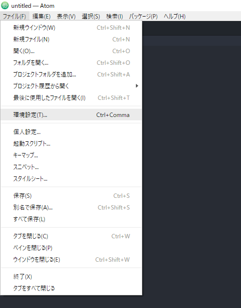
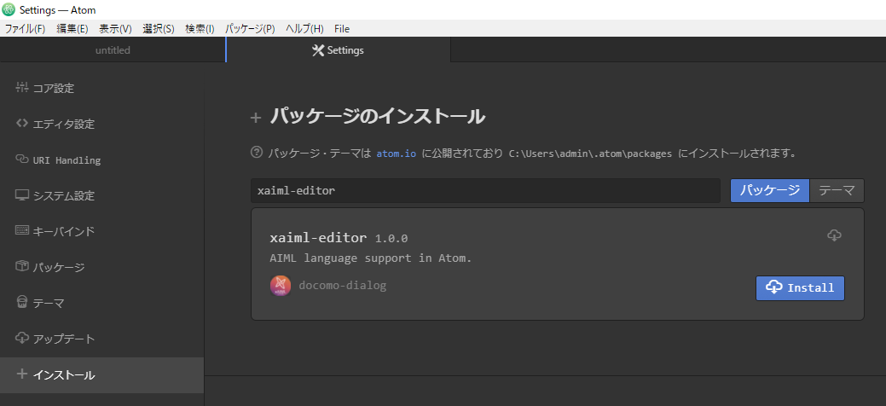
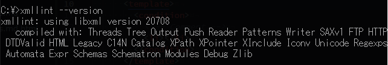
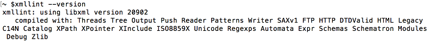
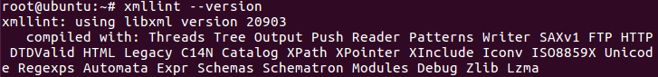
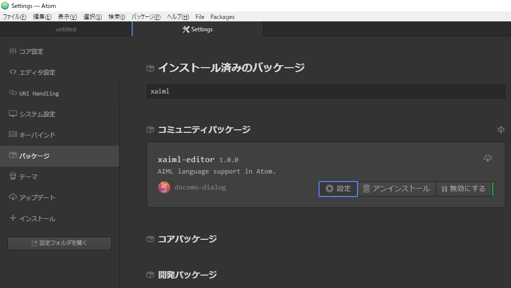
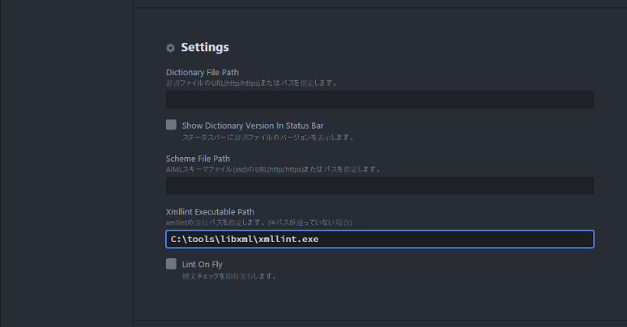

<a name="top"/>

# xaiml-editor インストールマニュアル

*for version 1.0.x*

[Atom] xAIML開発サポートパッケージ xaiml-editor のWindows環境向けインストール手順です。

動作確認済みOS
+ windows10 Pro version 1703
+ MacOS El Capitan version 10.11.6
+ Ubuntu 16.04.1 LTS

以下の項目について説明します。

+ [1. Atom インストール](#atom)
+ [2. xaiml-editor インストール](#package)
+ [3. xmllint インストール](#xmllint)

 

##### 凡例
  + `[]`: メニューバー操作
  + `<>`: キー操作

---

<a name="atom"/>

## 1. [Atom] インストール

既に [Atom] 1.13.0 以降がインストールされている場合は[次の手順](#package)に進みます。

1. [Atom]のWebサイト [https://atom.io/] からインストーラーをダウンロードします。

1. ダウンロードしたインストーラーを実行します。

 

[[先頭へ戻る](#top)]

---

<a name="package"/>

## 2. [xaiml-editor] インストール

[Atom]に本パッケージ xaiml-editor をインストールします。

1. [Atom]を起動します

1. メニューから Preferences(環境設定) を選択し、設定画面を開きます。

  

1. 画面左のメニューからInstall を選択し、 検索欄に xaiml-editor と入力して検索を行います。

1. 検索結果一覧の中から xaiml-editor を選択し、インストールを行います。

  

1. インストール完了後、[Atom]を再起動します。

   起動時にコミュニティーパッケージ [linter] とその関連パッケージのインストールが行われます。

 

[[先頭へ戻る](#top)]

---

<a name="xmllint"/>

## 3. [xmllint] インストール

xaiml-editor が構文チェック機能で使用する実行モジュールをインストールします。

1. 初めに xmllint のインストール及び環境変数の設定状況の確認を行います。

1. コンソール画面で `xmllint --version` と入力し、実行します。

1. 出力結果に `libxml version ...` が含まれており、バージョンが 20708 以上の場合は、  
適正バージョンの xmllint がインストール済みです。

  
  ※version 20708 動作確認済み
   
   

1. 出力結果に `libxml version ...` が含まれていない、もしくは libxml のバージョンが 20708 未満だった場合は、  
下記の手順を参考に xmllint のインストールを行います。

+ Windows

  1. [http://xmlsoft.org/sources/win32/] または [ftp://ftp.zlatkovic.com/libxml/] から以下のファイルをダウンロードし展開します。

    + libxml2-2.7.8.win32.zip
    + iconv-1.9.2.win32.zip
    + zlib-1.2.5.win32.zip

  1. 展開したファイルの中から以下のファイルを任意のフォルダ(例:*C:\\tools\\libxml*)に配置し、
配置したフォルダのパスを環境変数 *PATH* に設定します。

    + xmllint.exe
    + libxml2.dll
    + iconv.dll
    + zlib1.dll

  1. コマンドプロンプトで `xmllint --version` と入力し、出力結果に `libxml version ...` が含まれていることを確認します。

    
     

+ MacOS

  1. [https://brew.sh/index_ja] からHomebrewをインストールします。

  1. ターミナルで`brew install libxml2`と入力し、`libxml2`をインストールします。

  1. ターミナルで`xmllint --version`と入力し、出力結果に`libxml version ...`が含まれていることを確認します。

    
     

+ Linux

  1. コンソールで`apt-get install libxml2-utils`と入力し、`libxml2-utils`をインストールします。

  2. コンソールで`xmllint --version`と入力し、出力結果に`libxml version ...`が含まれていることを確認します。

    
     

+ 補足: 環境変数 *PATH* が使用できない場合

    環境変数 *PATH* がサイズオーバーなどにより使用できない場合、xaiml-editor の設定画面で xmllint.exe のパスを指定します。

    以下、設定手順です。

    1. 設定画面(`[File > Settings]`/`<Ctrl-,>`)の Packages ページを表示します。

    1. Community Packages リストにある xaiml-editor の Settings ボタンを押下します。

      
      ※ オレンジ枠部分

    1. Settings の Xmllint Executable Path に *xmllint.exe* のパスを入力します。

      例: *C:\\tools\\libxml\\xmllint.exe*

      
      ※ 青枠部分

 

[[先頭へ戻る](#top)]

---

**インストールは以上で完了です。**

 

[[先頭へ戻る](#top)]

***

<!-- link -->
[Atom]: https://atom.io/
[https://atom.io/]: https://atom.io/
[http://xmlsoft.org/sources/win32/]: http://xmlsoft.org/sources/win32/
[ftp://ftp.zlatkovic.com/libxml/]: ftp://ftp.zlatkovic.com/libxml/
[xmllint]: http://xmlsoft.org/xmllint.html
[https://brew.sh/index_ja]: [https://brew.sh/index_ja]
[xaiml-editor]: https://github.com/docomo-dialog/xaiml-editor
<!-- package -->
[linter]: https://atom.io/packages/linter
