<a name="top"/>

# xaiml-editor 操作マニュアル

*for version 1.1.0*

[Atom]: https://atom.io/

[Atom] xAIML開発サポートパッケージ xaiml-editor の操作マニュアルです。

以下の項目について説明します。

+ [動作条件](#conditions)
+ [オートコンプリート機能](#autocomplete)
+ [コメントトグル機能](#comment)
+ [構文チェック機能](#linter)
+ [属性値・要素内容一括置換機能](#replace)
+ [シンタックスハイライト機能](#syntax)
+ [highlight-selected日本語対応機能](#highlight)
+ [既知の問題](#problem)

 

##### 凡例
  + `[]`: メニューバー操作
  + `<>`: キー操作

<!--   -->

---

<a name="conditions"/>

## 動作条件

+ 本パッケージの動作環境は [Atom] 1.13.0 以降が対象となります。（1.28.0 動作確認済）
  ただし、[Atom]の将来的なバージョンアップにより正常に動作しなくなる可能性があります。

+ 各機能は、エディタのGrammarがAIMLの場合のみ動作します。

  + 拡張子が .aiml のファイルを開くとGrammarは自動的にAIMLとなります。
  + Grammarは `[Edit > Select Grammar]`、`<Ctrl-Shift-L>` 等で任意に設定可能です。

 

[[先頭へ戻る](#top)]

---

<a name="autocomplete"/>

## オートコンプリート機能

要素、属性、属性値の候補を表示／挿入する機能です。

### 操作方法

+ 該当箇所でプレフィックスを入力すると自動的に候補が表示されます。
+ 手動で候補を表示するには `<Ctrl-Space>` を入力します。
+ 表示中の候補はカーソルキー `<↑>` `<↓>` で選択し、`<Tab>` または `<Enter>` で決定します。
+ 表示中の候補を閉じるには `<Esc>` を入力します。

 

### 候補表示 操作例

<!-- 候補種別毎の操作例です。   -->

<!-- `■`: カーソル位置 -->

#### 要素

  + 開始タグのプレフィックス `<` を入力します。

  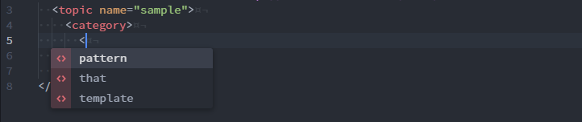

#### 属性

  + 要素タグ内でスペースを入力します。

  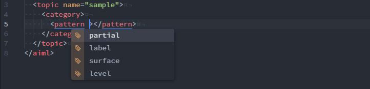

#### 属性値

  + 属性値の候補を表示するには、属性値クォーテーション内で `<Ctrl-Space>` を入力します。

  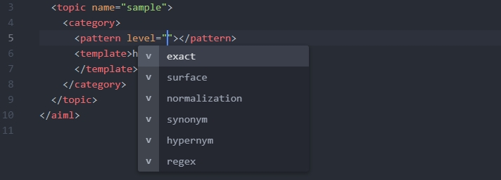

 

### スキーマバージョンの切り替え

+ 本パッケージの設定画面 `Suggest Options` → `Built-in Dictionary and Schema Version` にて、対応する xAIML のバージョンを切り替えることができます。
+ 上記の設定により、オートコンプリートの候補一覧を選択バージョンに適したものへと切り替えることができます。

  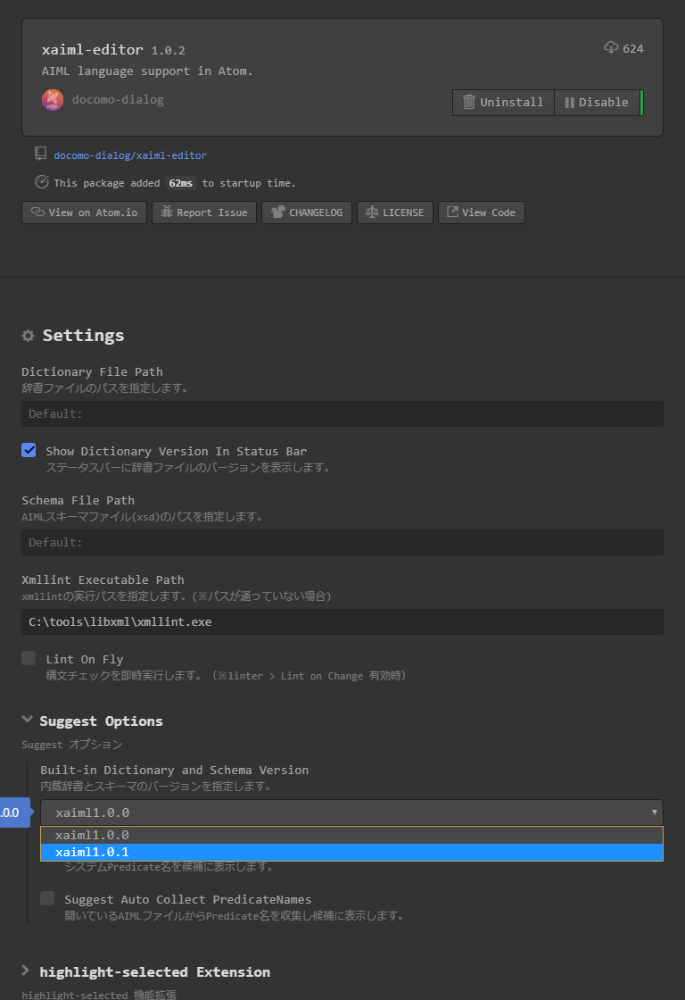

+ xaiml1.0.0

  

+ xaiml1.0.1

  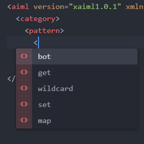

 

### キーバインド変更

+ 候補の選択、決定等に使用するキーの変更は、コアパッケージ [autocomplete-plus] の設定で行います。
変更方法は [autocomplete-plus] の [Usage] や [Remapping Movement Commands] を参照してください。

[autocomplete-plus]: https://atom.io/packages/autocomplete-plus
[Usage]: https://github.com/atom/autocomplete-plus#usage
[Remapping Movement Commands]: https://github.com/atom/autocomplete-plus#remapping-movement-commands

 

### 関連パッケージ

+ 本機能はコアパッケージ [autocomplete-plus] のプロバイダとして動作します。
  ※[autocomplete-plus] の設定変更により本機能の動作も変化します。

 

### 制限事項

+ ファイルサイズが2MB以上の場合、本機能は無効となります。

 

[[先頭へ戻る](#top)]

---

<a name="comment"/>

## コメントトグル機能

入れ子に対応したコメントのON/OFFを切り替える機能です。

### 操作方法

+ 範囲選択後、`<Alt-/>` を入力します。
+ 範囲選択されていない場合、カーソル行が対象となります。

 

### 標準機能との違い

標準のコメントトグル機能 `<Ctrl-/>` との相違点です。

+ 選択範囲の一部にコメントタグが含まれる場合、コメントタグをエスケープしてコメントアウトします。

  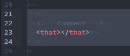 → 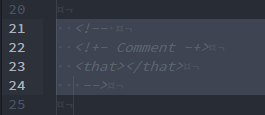

  ※コメント解除時はエスケープしたコメントタグを復元します。

+ 選択範囲が全てコメントの場合、コメントの解除を行います。

  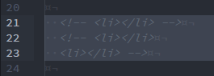 → 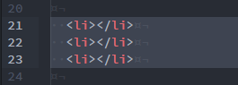

+ 範囲選択されていない場合、カーソル行のコメント切り替え後、下の行にカーソルが移動します。

  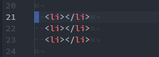 → 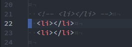

 

### 制限事項

+ マルチカーソルには対応していません。

 

[[先頭へ戻る](#top)]

---

<a name="linter">

## 構文チェック機能

xAIMLの構文チェックを行い、問題点を警告する機能です。

[xmllint]: http://xmlsoft.org/xmllint.html

### 操作方法

+ ファイル保存(`[File > Save]`/`<Ctrl-S>`)に連動して実行されます。
+ 任意に実行するには `<Alt-L>` を入力します。
+ 本パッケージの設定画面で Lint On Fly を有効にすると即時実行されます。

  

  ※[linter] の設定 Lint on Change が有効となっている必要があります。

 

### 関連パッケージ

+ 本機能はコミュニティーパッケージ [linter] のプロバイダとして動作します。
※[linter] の設定変更により本機能の動作も変化します。

[linter]: https://atom.io/packages/linter

 

### 制限事項

+ ファイルとして保存されていないバッファは対象外となります。

 

[[先頭へ戻る](#top)]

---

<a name="replace"/>

## 属性値・要素内容一括置換機能

プロジェクト内の属性値と要素内容の一括置換を行う機能です。
編集開始時の値に一致する全ての属性値、要素内容を置換実行時の値に置換します。

※開いているファイル以外はUndoできないため注意して実行してください。

### 置換可能な値

+ 改行が含まれない属性値
+ 改行、子要素、その他のタグが含まれない要素内容

<!-- 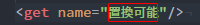   -->
<!-- 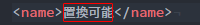   -->

 

### 操作方法

1. **編集開始:** 置換したい値にカーソルを移動し `<Alt-R>` を入力します。
1. **値の編集:** 新しい値を入力します。
1. **編集中止:** 編集開始後、値の範囲外にカーソルを移動すると編集開始がキャンセルされます。
1. **置換実行:** 値の編集後、再度 `<Alt-R>` を入力すると置換を実行します。

 

### 置換対象

+ 置換を実行したファイルと同一プロジェクト内のAIMLファイル(\*.aiml)が対象となります。
+ ファイルとして保存されていないバッファは対象外となります。
+ 2MB以上のファイルは対象外となります。

 

### 制限事項

+ ファイルサイズが2MB以上の場合、本機能は無効となります。

 

[[先頭へ戻る](#top)]

---

<a name="syntax"/>

## シンタックスハイライト機能

AIMLファイル(\*.aiml)を開くと自動的に有効になります。

### 制限事項

+ ファイルサイズが2MB以上の場合、本機能は無効となります。

 

[[先頭へ戻る](#top)]

---

<a name="highlight"/>

## highlight-selected日本語対応機能

コミュニティーパッケージ [highlight-selected] を日本語選択時も動作するよう拡張する機能です。
関連パッケージがインストールされている環境で有効となります。

### 関連パッケージ

+ [highlight-selected]
<!-- + [minimap-highlight-selected] -->

### 制限事項

+ 本機能は関連パッケージの将来的なバージョンアップにより正常に動作しなくなる可能性があります。

  現在動作確認が取れている関連パッケージのバージョンは以下になります。

  + [highlight-selected] 0.13.1
  <!-- + [minimap-highlight-selected] 4.6.1 -->

[highlight-selected]: https://atom.io/packages/highlight-selected
<!-- [minimap-highlight-selected]: https://atom.io/packages/minimap-highlight-selected -->

 

[[先頭へ戻る](#top)]

---

<a name="problem"/>

## 既知の問題
Atomで発生する問題について（Atom 1.19.7 現在)

+ ファイルサイズが2MB以上の場合に構文解析が機能せず、シンタックスハイライトが行われない現象が発生します。
このため本パッケージでは、構文解析が必要な一部機能で2MB以上のファイルに対する動作を制限しています。

<!-- + サイズが大きいファイルや長い行が含まれるファイルの表示、編集、保存などを行った場合、
極端なレスポンス低下、フリーズ、クラッシュなどが発生することがあります。

  ※安定した状態で使用するために、Atomではなるべく1MB以上のファイルを開かないことをおすすめします。 -->

### 参考情報
[Atom Issues](https://github.com/atom/atom/issues)
+ Syntax highlighting conditionally works on super-long HTML file [\#11232]

<!--
+ Atom hangs and uses 100% when saving a large file for the first time [\#10917]
+ Crashes or hangs when reloading large file [\#9825]
+ Loading large file with many lines sometimes unresponsive [\#8864]
+ Files with large extremely long lines cause hangs [\#979]
-->

[\#11232]: https://github.com/atom/atom/issues/11232
<!-- [\#10917]: https://github.com/atom/atom/issues/10917
[\#9825]: https://github.com/atom/atom/issues/9825
[\#8864]: https://github.com/atom/atom/issues/8864
[\#979]: https://github.com/atom/atom/issues/979 -->

 

[[先頭へ戻る](#top)]

---
